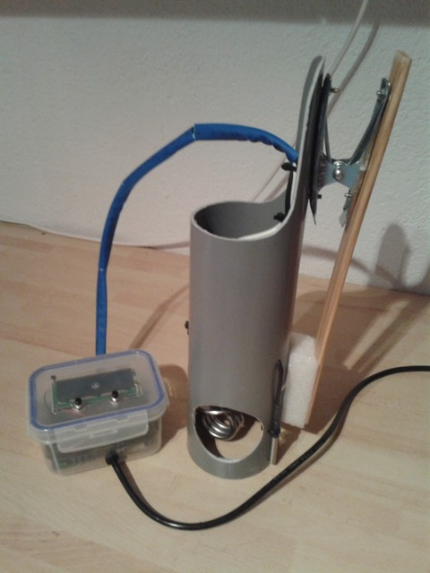
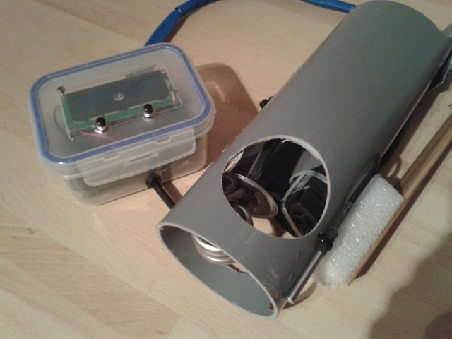
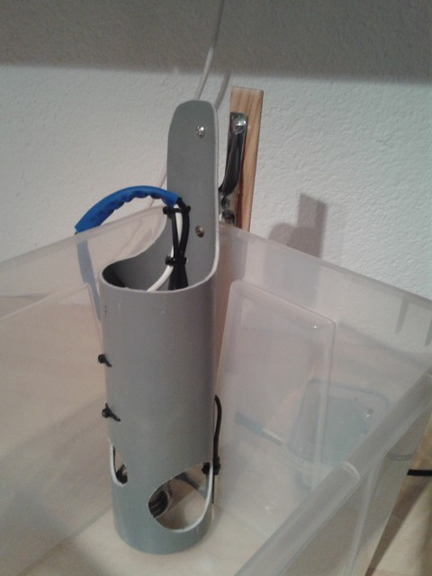
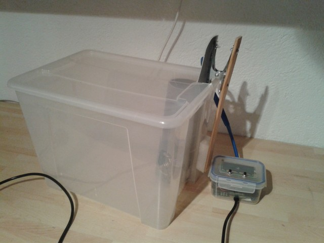

# Sous vide immersion cooker

Own version of a sous vide immersion cooker. Very similar to other projects like
http://seattlefoodgeek.com/2010/02/diy-sous-vide-heating-immersion-circulator-for-about-75/
http://www.lindens.nu/projects/sous-vide/en.htm

##Parts list
#####Electronics:
 - Arduino nano v3
 - 16x2 LCD display
 - 5V mechanical relay
 - 12V Power adapter
 - Waterproof DS18B20 sensor
 - 300W immersion heater
 - Small aquarium pump
 - 2 Push buttons
 - Lots of DuPont cables (male->female, female->female)
 - Small pieces of breadboard

#####Enclosure and structure:
 - Small translucent tupperware as housing
 - Piece of drainpipe (12cm diameter)
 - Metal tongs & piece of wood to make the big clamp
 - Zipties
 - Rubber grommets

## Setup

The drainpipe houses the immersion heater and the waterpump on the inside, fastened with zipties, and the thermometer is located outside of the drainpipe.
Make a few holes to let water circulate freely.

The enclosure is separated into to parts, the lower part contains the high voltage components.
The 12v power supply (from a salvaged AC wall charger) and the water pump are connected directly to the mains input and the heater is connected through the relay so it can be switched on and off freely.

The upper parte of the enclosure houses the Arduino nano, a small board with resistors for the switches, the thermometer, the pot for the lcd display and a 5V/GND bus.
The LCD display and the buttons are screwed directly to the lid.

It's best used with a 22l PVC box or similar for bigger foods (Lid can be put on if you cut out an edge), or a bigger cooking pot.

##Software
The software basically turns the heater on and off depending on the target temperature (controlled by the buttons) and the temperature read off the sensor.
It turns out the 300W heater is small enough so that the temperature doesn't overshoot too much, so a PID controller was not necessary.

The only extra functionality is a timer that starts counting once the target temperature has been reached.

##Conclusions
On the whole the setup works perfectly fine for our use. A drawback is that the heater is not powerful enough to heat a lot of cold water, so it's better to start off with warm water (warm tap water is usually around 50, so it's a great starting point).
The temperature is actually pretty precisely held and there are no major fluctuations, even though it doesn't have a sofisticated control algorithm.

Maybe for a next time I'd have include a buzzer to beep once the target temp has been reached, and maybe the possibility to set a timer (would need a few extra buttons, though)

I had problems finding a transparent enclosure to house the lcd and the Tupperware actually worked out nicely - and it was cheap!

Maybe an accesible USB port would have been nice, especially in the first phases when you're still  tweaking the software.

##Images

Closeup of the internal part of the circulator

Clamped inside the Sammla box

Inside Sammbla box with lid on

